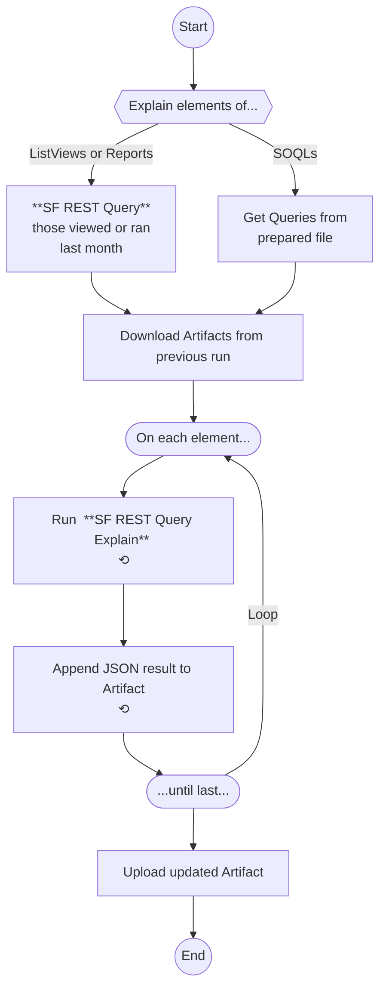

# Measure Salesforce Database Performance with Query Plan

## Overview
This GitHub Action automates the measurement of database performance in Salesforce by analyzing Query Plans. It tracks the results of Query Plan parameters on ListViews, Reports, and Queries from input files.

Utilizes REST communication with Salesforce CLI on [Query Explain endpoint](https://developer.salesforce.com/docs/atlas.en-us.api_rest.meta/api_rest/dome_query_explain.htm)  
`curl https://MyDomainName.my.salesforce.com/services/data/v63.0/query/?explain=
SELECT+Name+FROM+Merchandise__c+WHERE+CreatedDate+=+TODAY+AND+Price__c+>+10.0`

## Features
- **Automated Query Plan Analysis**: Extracts and evaluates Query Plans for List Views, Reports, and SOQL queries.
- **Continuous Monitoring**: Runs on each pull request to identify database inefficiencies early.
- **Historical Comparison**: Retains previous Query Plan results as JSONs, storing them in Action's Artifacts.
- **Query Detection in Apex & Flows**: Notifies about potential database queries introduced in Apex classes and Flow metadata.

## How It Works

1. **Trigger on Pull Request**: By default, the workflow executes when a PR is opened or updated.
2. **Retrieve List Views and Reports**: Using REST API, retrieves list of List Views and Reports that were used last month, to pass them into Explain endpoint.
3. **Query Plan Extraction**:
    - Fetches Query Plans for List Views and Reports retrieved from Salesforce automatically.
    - Reads predefined SOQL queries from CSV files, that should be filled manually.
3. **Performance Tracking**: Captures execution plans, indexes used, and cost estimates.
4. **Artifacts Storage**: Saves Query Plan results as artifacts for tracking changes over time.
5. **Commenting on PRs**:
    - Detects new queries in Apex classes, whenever `SELECT` or `QUERY` are found in `.cls` files.
    - Identifies database interactions in Salesforce Flows.

## Setup
1. **Get Salesforce Access Token for SF CLI**
2. **Configure GitHub Secrets**:
    - `SFDX_AUTH_URL`: Authentication token for Salesforce.
2. **Add Queries to CSV Files**:
    - Place SOQL queries in `./queryPlanExplains/soqlsToExplain.csv` and `./queryPlanExplains/queriesFromFlowsToExplain.csv`. Both are processed identically, split is for organization purposes.

## Contributions
You are welcome to put some work into it.

## License
This project is licensed under the MIT License.

